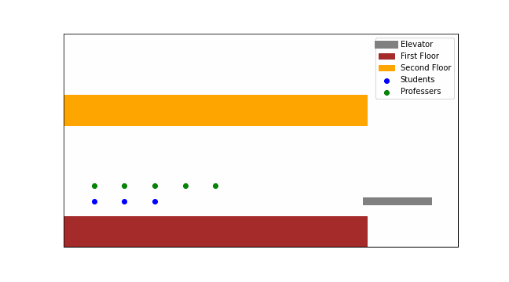

# Artificial Intelligence 🤖🧠

**Solutions to practical assignments of Artificial Intelligence course (CE-417) at Sharif University of Technology**

This repository contains solutions for the practical assignments given in the AI course, covering various essential topics in artificial intelligence. Each assignment implements a specific AI technique or algorithm to solve real-world problems, showcasing the theoretical concepts in action.

## Table of Contents
> - [A Star](#A\*)
> - [Simulated Annealing](#Simulated_Annealing)
> - [Cryptarithmetic Puzzle](#Cryptarithmetic_Puzzle)
> - [Adversarial Search](#Adversarial_Search)
> - [Q_Tabular](#Q_Tabular)
> - [RL_Chat](#RL_Chat)
> - [Bayesian Networks](#Bayesian_Networks)
> - [Decision Tree](#Decision_Tree)
> - [Logistic Regression](#Logistic_Regression)

* ### **A\***:
  Implements the A* search algorithm to solve an elevator scheduling problem where students and professors must be transported between two floors, following specific constraints.
    
  
    
  **Problem Description**:
  The elevator needs to move students and professors between two floors with the following constraints:
  - No floor should have more students than professors (if professors are present).
   - The solution must ensure that all students and professors are transferred safely across floors.

  **Approach**:
  The problem is represented as a graph, where each state is described by the number of students and professors on each floor, and the position of the elevator. A* uses a heuristic to search for the 
   optimal path from the initial to the final state, ensuring efficiency and optimality.
      
  **Comparison with DFS**:  
      The A* algorithm outperforms DFS in terms of finding shorter paths, thanks to its heuristic function, though it explores more states.

  See this [file](https://github.com/Amirreza81/Artificial-Intelligence/blob/main/A-star/A_star.ipynb) for more details.

* ### **Simulated_Annealing**:
  Demonstrates optimization using the Simulated Annealing algorithm for solving the Knapsack problem.
    
  **Problem Description**:
      The Knapsack problem involves selecting a subset of items with specific weights and values to maximize the total value without exceeding a given weight limit.

  **Approach**:
      Simulated Annealing is a probabilistic algorithm that explores the solution space by accepting worse solutions with decreasing probability over time (as the temperature cools). This helps escape 
  local optima and leads to a near-optimal solution.

  **Results**:  
      The algorithm finds an average best solution with a value of approximately 2595.05 over multiple runs, demonstrating its effectiveness in solving the Knapsack problem.

  See this [file](https://github.com/Amirreza81/Artificial-Intelligence/blob/main/Simulated%20Annealing/Simulated_Annealing.ipynb) for more details.

* ### **Cryptarithmetic_Puzzle**:  
    The Cryptarithmetic Puzzle is a puzzle where the digits of some numbers are replaced with letters to make a mathematical equation. Each letter represents a unique digit from 0 to 9 (in case of base 10). The puzzle has the following constraints:

    - Each letter can be replaced by a digit from 0 to 9 (in case of base 10), but no digit can be used twice.
    - Each letter must be replaced by the same digit throughout the puzzle.
    - The leftmost digit of each number cannot be zero.

    
    
* ### **Adversarial_Search**:  
    Minimax algorithm for game-playing agents with alpha-beta pruning.
    
* ### **Q_Tabular**:  
    Implementation of Q-learning with tabular updates for reinforcement learning.
    
* ### **RL_Chat**:  
    A simple chat system utilizing reinforcement learning for decision-making.

* ### **Bayesian_Networks**:
    Building and inference on Bayesian networks for probabilistic reasoning.

* ### **Decision_Tree**:
    Implementing decision tree algorithms for classification tasks.

* ### **Logistic_Regression**:
    Logistic regression for binary classification.  

## Instructor ✍
[Professor Mohammad Hossein Rohban](https://www.linkedin.com/in/mohammad-hossein-rohban-75567677/?originalSubdomain=ir)

## Contribution 👥
Feel free to fork this repository, submit pull requests, or raise issues if you find any bugs or have suggestions for improvements.
